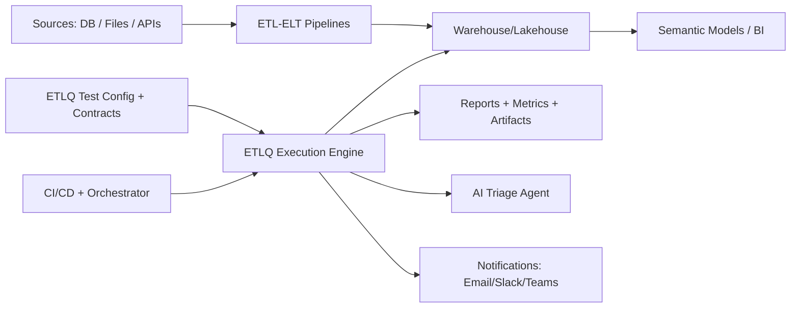
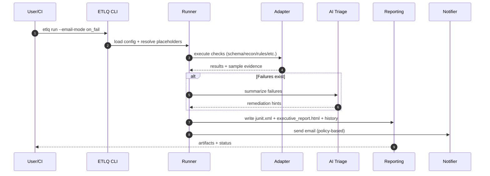
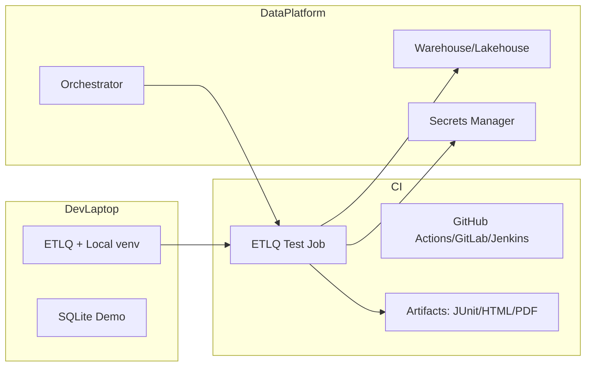
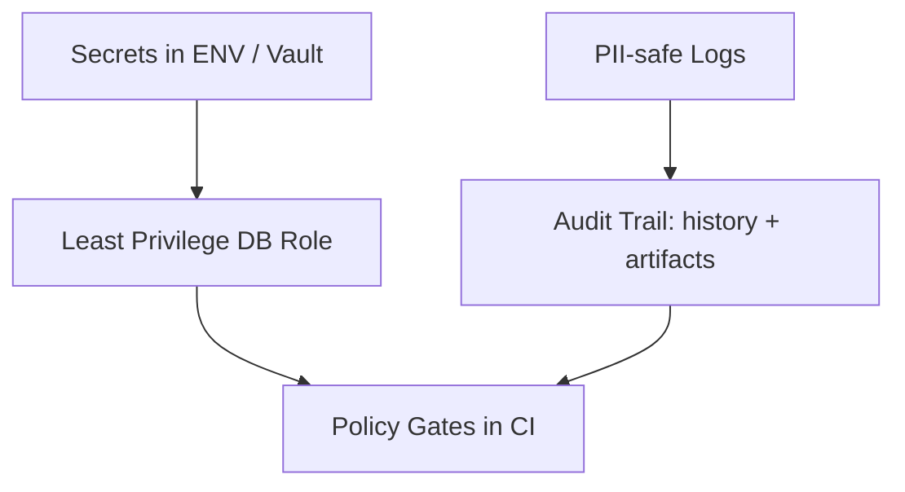

# ETL Testing Framework Architecture

This document describes the target architecture for the ETLQ framework and how current implementation maps to it.

---

## 1) System Context



---

## 2) Logical Architecture (Component View)

```mermaid
flowchart TB
  subgraph ConfigLayer[Config + Contracts]
    C1[tests.yaml]
    C2[entities.yaml]
    C3[business_rules.yaml]
    C4[lineage.yaml]
    C5[table_tiers.yaml]
  end

  subgraph Core[ETLQ Core]
    P1[Config Loader + Placeholder Renderer]
    P2[Test Planner/Selector]
    P3[Assertion Engine]
    P4[Adapter Interface]
  end

  subgraph Adapters[Execution Adapters]
    A1[SQLite Adapter (current)]
    A2[Snowflake Adapter (planned)]
    A3[BigQuery Adapter (planned)]
    A4[Databricks Adapter (planned)]
  end

  subgraph Intelligence[AI + Agent]
    I1[AI Triage Helper]
    I2[LangGraph Agent: Plan->Execute->Analyze]
    I3[Test Generator from Schema+Lineage]
    I4[Severity Ranker]
  end

  subgraph Delivery[Delivery + Ops]
    D1[ETLQ CLI]
    D2[MCP Server]
    D3[JUnit + Executive HTML/PDF]
    D4[Email/CIO Summary]
    D5[History + Flaky Analysis]
  end

  ConfigLayer --> P1 --> P2 --> P3 --> P4
  P4 --> Adapters
  P3 --> Intelligence
  Intelligence --> Delivery
  P3 --> Delivery
```

---

## 3) Runtime Flow (Sequence)



---

## 4) Current Implementation Mapping

- **Config layer:** implemented
  - `config/tests.yaml`, `entities.yaml`, `business_rules.yaml`, `lineage.yaml`, `table_tiers.yaml`
- **Core:** implemented
  - loader, planner, assertions, context
- **Adapters:** partial
  - SQLite implemented, cloud adapters planned
- **AI/Agent:** implemented
  - OpenAI-compatible triage
  - LangGraph agent pipeline
  - metadata-driven test generation
  - severity ranker
- **Delivery/Ops:** implemented
  - ETLQ CLI
  - MCP server
  - JUnit + executive report + trend history
  - SMTP/Gmail reporting

---

## 5) Deployment Topology



---

## 6) Data Quality Taxonomy Coverage

| Category | Status |
|---|---|
| Schema | Implemented |
| Completeness/Rowcount Recon | Implemented |
| Business Rules | Implemented |
| Incremental Watermark | Implemented |
| SCD2 Current Integrity | Implemented |
| Lineage-Based Recon/Orphan | Generated checks implemented |
| Freshness | Implemented (heuristic) |
| Anomaly Detection | Planned |
| Performance/Cost checks | Planned |
| Metadata/Lineage API integration | Planned |

---

## 7) Security & Governance Architecture



Principles:
- no secrets in repo
- read-only validation roles where possible
- avoid raw sensitive payloads in reports
- gate deployments by severity and policy

---

## 8) Extension Points

1. **Adapter plugins** for Snowflake/BigQuery/Databricks/Redshift/Postgres
2. **Assertion plugins** for anomaly, distribution, SLA burn-rate
3. **Notification plugins** for Slack/Teams/Jira/ServiceNow
4. **Contract backends** for protobuf/JSON-schema/OpenAPI/event contracts
5. **Lineage providers** (OpenLineage, DataHub, Marquez)

---

## 9) Design Decisions (ADR-style summary)

1. **Config-first + code-extensible** for maintainability
2. **Pytest foundation** for CI portability and ecosystem maturity
3. **Adapter abstraction** to avoid warehouse lock-in
4. **AI as assistant, not authority** (evidence-first failures)
5. **Executive report layer** for adoption beyond engineering

---

## 10) Near-Term Architecture Roadmap

### Phase 1 (current)
- local/demo-ready quality engine + AI + MCP + reporting

### Phase 2
- cloud warehouse adapters
- robust CI gates + flaky quarantine policy
- Slack/Teams + ticketing integration

### Phase 3
- lineage API integration
- anomaly detection + cost-aware planning
- enterprise governance (RBAC, audit dashboards)

---

## 11) Commands

### Run full UX flow
```bash
./scripts/etlq run --email-mode on_fail --brand "Raj Data Quality" --pdf --cio-email
```

### Run AI agent
```bash
PYTHONPATH=. python -m agent.run_agent --request "run critical checks and provide remediation"
```

### Generate checks from metadata
```bash
PYTHONPATH=. python -m agent.generate_tests
```

### Run MCP server
```bash
python -m mcp_server.server
```
