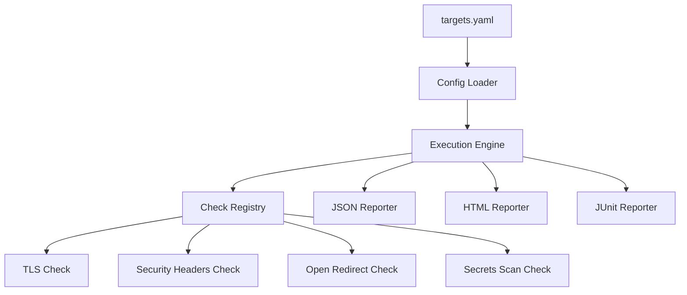
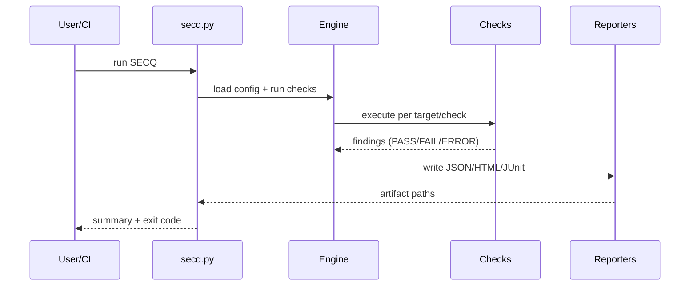

# SECQ Architecture

## Component view

## Runtime flow

## Security model
- No hardcoded credentials in code
- Externalize secrets via env/secret manager
- Read-only testing identity where possible
- Controlled scan targets and allowlists

## Scalability model
- Add threaded/async execution per target
- Add adapter model for authenticated/API/internal checks
- Add distributed execution for large estate scans

## Quality model
- Deterministic checks first (policy + headers + cert + static)
- Stateful checks optional (auth flows)
- Fail-fast mode for critical checks in CI
